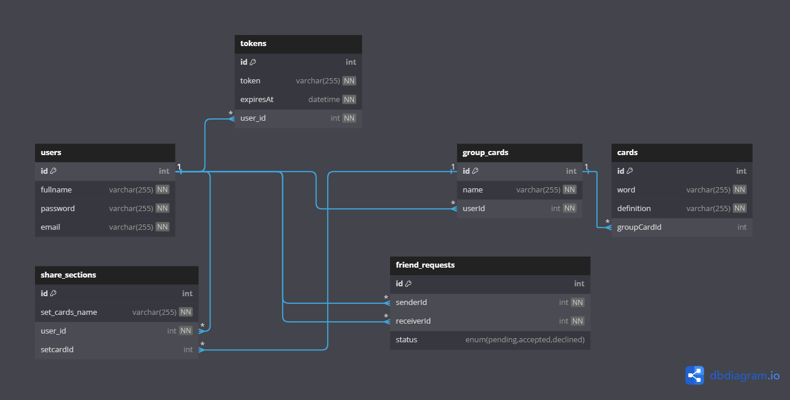

# FlashCard Web

A user-friendly flashcard web that lets you create, organize, and study cards with ease. Perfect for learning new concepts, preparing for exams, and staying organized!

## Table of Contents

1. [Project Overview](#project-overview)
2. [Key Features](#key-features)
3. [Technologies Used](#technologies-used)
4. [Modeling](#modeling)
5. [Setup](#setup)
6. [Running the Application](#running-the-application)


## Project Overview

This project allows users to register, log in, and manage their cards and sets. Users can send friend requests, view friend profiles, and share cards with friends. It provides a seamless and interactive way to create and organize learning materials while fostering a social learning experience. 

## Key Features

- **Authentication**: Secure login, user registration, and password reset functionality.
- **Card Management**: Create, edit, and organize flashcards in sets for efficient learning.
- **Search Functionality**: Search and filter both individual cards and card sets for quick access.
- **Friend Management**: Add and search for friends, as well as view and share cards with them.


## Technologies Used

- **React** 
- **Nodejs** 
- **Sequelize**
- **PostgreSQL**
- **JWT**
- **Nodemailer**


## Modeling



## Setup

To set up the project on your local machine, follow these steps:

### 1. Clone the Repository

Clone the project repository from GitHub to your local machine.

```bash
git clone https://github.com/VuAnhKiet/Flashcard.git

```
### 2. Install Dependencies
Create two split terminals, each running separately
#### Frontend
```bash
cd client 
npm install
```
#### Backend
```bash
cd server 
npm install
```
### 3. Set Up Environment Variables
Create .env file following those schema
#### Frontend
```bash
//Must has "REACT_APP_" Prefix or not, those will not work
REACT_APP_API_URL=http://localhost:3001
REACT_APP_API=http://localhost:3000
```
Place this in:
```bash
+---client
       |---.env
``` 
#### Backend
```bash
PORT=3001

DB_PORT=5432
DB_HOST='localhost'
DB_NAME='your_database_name'
DB_PASSWORD='your_database_password'
DB_USER=postgres

JWT_SECRET="your_secret_JWT_key"
JWT_EXPIRATION=3600

EMAIL="your_gmail_username"
EMAIL_PASSWORD="your_gmail_app_password"
```
Place this in: 
```bash
+---server
       |---.env
``` 
About "EMAIL_PASSWORD". Gmail nowadays only accepts app-password, please create one with 16 digits.
### 4. Set up the Database
In the server's terminal, run: 
```bash
npm start
```
After finishing, create another terminal in the server folder and run the following command to seed the user data:
```bash
npm run seeder
``` 
### 5. Dockerization (Optional)
Go back to the root folder which contains **docker-compose.yml**, run:
```bash
docker-compose --env-file ./server/.env  up --build
```
## Running the Application
In the server's terminal make sure it's still running or not, run:
```bash
npm start
``` 
In the client's terminal:
```bash
npm start
```
**Note**: Add group cards to share section by dragging 
